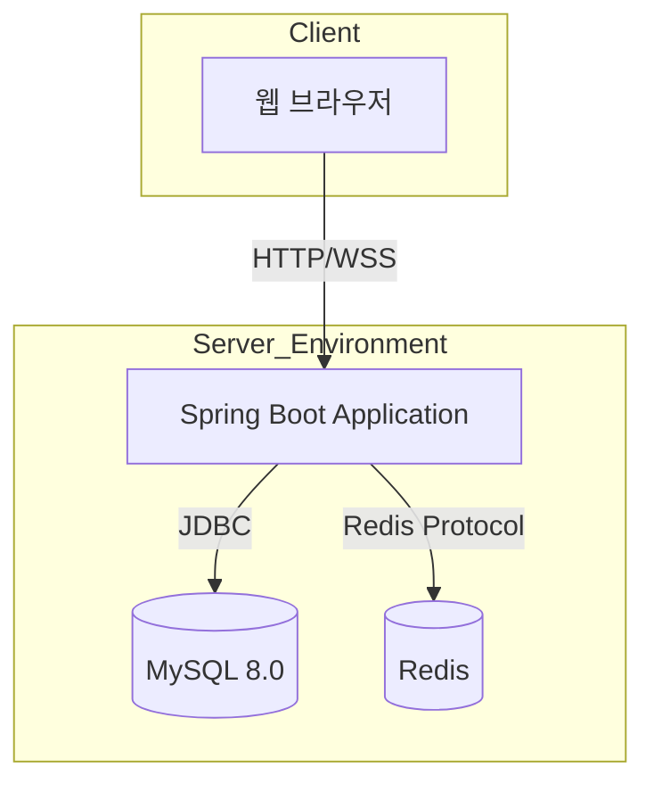

# 겟츄 (Getchu) - 동시성·캐싱·실시간 채팅 기반 중고거래 백엔드

> **동시성 제어, 분산 캐싱, 실시간 채팅을 직접 구현하여 정합성과 성능을 확보한 중고거래 백엔드 시스템 '겟츄'입니다.**

---

## 📑 목차
- [프로젝트 비전](#-프로젝트-비전)
- [핵심 기술 포인트](#-핵심-기술-포인트)
- [주요 기능](#-주요-기능)
- [사용자 시나리오](#-사용자-시나리오)
- [팀 구성 및 역할](#-팀-구성-및-역할)
- [기술 스택](#-기술-스택)
- [시스템 아키텍처](#-시스템-아키텍처)
- [대표 문서](#-대표-문서)

---

## 🎯 프로젝트 비전

중고거래 서비스의 핵심은 **정확한 상태 관리**와 **신뢰할 수 있는 소통**입니다. 겟츄는 단순 CRUD를 넘어 다음과 같은 기술적 과제를 직접 해결하는 데 집중했습니다.

1. **중복 예약 방지 (공정성)**: 인기 상품에 여러 명이 동시에 '예약'을 시도할 때, Lettuce 분산락을 통해 데이터 정합성을 보장합니다.
2. **조회 성능 최적화 (사용성)**: 반복 조회되는 상품 상세 정보와 카테고리 필터링 시 DB 부하를 최소화하기 위해 캐싱 전략을 적용했습니다.
3. **실시간 소통 (연결성)**: 구매자와 판매자가 끊김 없이 실시간으로 대화할 수 있는 WebSocket 기반 채팅 환경을 제공합니다.

---

## 🛠 핵심 기술 포인트

| 주제 | 해결 방안 | 기술 연결 |
|------|-----------|-----------|
| **동시성 제어** | 동일 상품에 대한 중복 예약 시도 차단 | **Lettuce SETNX 분산락** + 지수 백오프 스핀락 |
| **분산/로컬 캐싱** | 상품 상세 조회 및 카테고리 필터링 성능 개선 | **Caffeine (Local)** & **Redis (Global)** Cache-Aside |
| **실시간 통신** | 1:1 구매자-판매자 채팅 구현 | **WebSocket** + **STOMP** |
| **공간 데이터 처리** | 반경 내 근처 상품 거리순 조회 | **MySQL Spatial (GEOMETRY)** + **Kakao Map API** |

---

## ✨ 주요 기능

### 1. 회원 및 위치 인증
- **JWT 인증**: 보안성 높은 회원 관리
- **동네 인증**: GPS 좌표 또는 주소 텍스트 기반 행정구역 인증 (카카오 API 연동)

### 2. 상품 및 검색
- **QueryDSL 동적 쿼리**: 복잡한 필터링 조건에서도 정교한 검색 제공
- **카테고리 시스템**: 다층 구조의 카테고리 분류 및 필터링 조회

### 3. 거래 및 채팅
- **거래 상태 머신**: `판매중` → `예약중` → `거래중` → `판매완료` → `리뷰` 단계별 상태 관리
- **실시간 채팅**: WebSocket 기반 1:1 대화 및 채팅 목록 관리

### 4. 관심 및 리뷰
- **찜하기**: 관심 상품 보관 및 관리
- **리뷰 시스템**: 거래 완료 후 상호 신뢰도 평가

---

## 👤 사용자 시나리오 (페르소나)

### 🍎 판매자 "김민준" (26세, 대학원생)
- **Goal**: 안 쓰는 물건을 빠르게 정리하고, 신뢰할 수 있는 구매자에게 팔고 싶다.
- **Pain Point**: 여러 명에게 동시에 메시지가 올 때 예약 관리가 힘들다.
- **Scenario**: 상품 등록 → 실시간 채팅 응답 → **Lettuce 분산락을 통한 안전한 예약 확정** → 거래 완료 처리.

### 🍏 구매자 "이서연" (29세, 직장인)
- **Goal**: 내 주변에서 상태 좋은 가구를 저렴하게 찾고 싶다.
- **Pain Point**: 이미 팔린 물건이 보이거나, 검색 결과가 느려 탐색이 피로하다.
- **Scenario**: **카카오 API 기반 동네 인증** → **MySQL 공간 쿼리를 통한 반경 내 상품 조회** → 캐시된 결과로 빠른 탐색 → 실시간 채팅 문의.

---

## 👥 팀 구성 및 역할

| 이름 | 역할 및 담당 도메인 | 주요 기여 내용 |
|------|---------------------|----------------|
| **신현민** | **Member & Map** | 카카오 API 연동, 동네 인증, JWT 인증 관리, RestDocs |
| **김인목** | **Chat & Redis** | WebSocket/STOMP 실시간 채팅 구현, Redis 글로벌 캐싱 전략 수립 |
| **정채림** | **Product & Search** | QueryDSL 기반 상품 검색, Caffeine 로컬 캐시 적용 |
| **소수경** | **Trade & Concurrency** | 거래 상태 관리 시스템, Lettuce 분산락 기반 동시성 제어, 찜하기 |

---

## 💻 기술 스택

- **Language**: Java 17
- **Framework**: Spring Boot 3.x
- **Persistence**: Spring Data JPA, QueryDSL, MySQL 8.0 (Spatial Data)
- **Cache**: Redis (Lettuce), Caffeine Cache
- **Real-time**: WebSocket, STOMP
- **Document**: Spring REST Docs

---

## 📐 시스템 아키텍처

---

## 📄 대표 문서

- 📖 [프로젝트 개요서](https://github.com/Team-5th-Chat-prj/Team-5th/blob/develop/docs/SA/01-%ED%94%84%EB%A1%9C%EC%A0%9D%ED%8A%B8%20%EA%B0%9C%EC%9A%94%EC%84%9C.md)
- 📋 [기능 명세서](https://github.com/Team-5th-Chat-prj/Team-5th/blob/develop/docs/SA/04-%EA%B8%B0%EB%8A%A5%20%EB%AA%85%EC%84%B8%EC%84%9C.md)
- 🗄️ [ERD 설계](https://github.com/Team-5th-Chat-prj/Team-5th/blob/develop/docs/SA/05-ERD.md)
- 🔒 [동시성 제어 설계서](https://github.com/Team-5th-Chat-prj/Team-5th/blob/develop/docs/SA/09-%EB%8F%99%EC%8B%9C%EC%84%B1%20%EC%A0%9C%EC%96%B4%20%EC%84%A4%EA%B3%84%EC%84%9C.md)

---

Copyright © 2026 Team 5th. All Rights Reserved.
